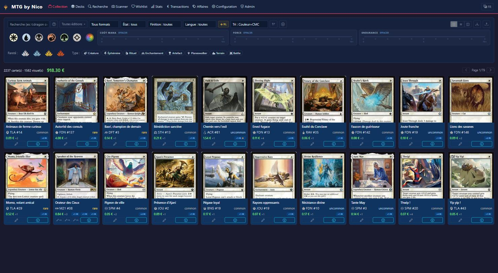

# MTG by Nico

Gestionnaire de collection **Magic: The Gathering** pour Windows — gratuit, léger, aucune configuration requise.

## Installer

1. Récupère `MTGbyNicoSetup.exe` depuis les [Releases](https://github.com/MagicCode666/MTGbyNico-dist/releases/latest)
2. Lance l'installateur (quelques secondes, aucune option à configurer)
3. L'app s'ouvre automatiquement dans ton navigateur, sur `localhost`

Tes données (collection, decks) restent stockées en local sur ta machine.

## Fonctionnalités (version gratuite)

- **Collection** — toutes tes cartes, filtres avancés, valeur totale en temps réel
- **Recherche** — moteur de recherche complet sur toute la base Scryfall (plus de 100 000 cartes), syntaxe avancée (couleur, type, texte, rareté, coût...)
- **Decks** — création et gestion de decks, vue façon MTG Arena
- **Stats** — répartition par couleur, rareté, set, valeur de la collection
- **Mise à jour automatique** — l'app se tient à jour toute seule, sans rien faire

## Fonctionnalités avancées

Certains outils plus poussés — **veille du marché** et **détection des bonnes affaires** chez les vendeurs CardMarket — sont débloqués via une clé d'accès personnelle, à activer directement dans l'app.

## Support

Un bug, une idée ? Ouvre une [issue](https://github.com/MagicCode666/MTGbyNico-dist/issues).
